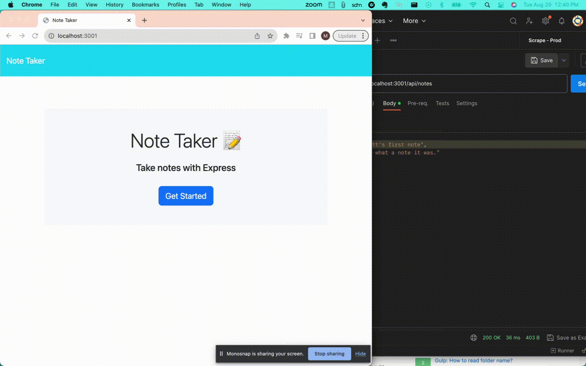

# Note Taker App

## Description

This application was created as a way for users to add notes for themselves, and keep track of their to-do list. 
In this day and age, it's hard to keep track of all of your thoughts and tasks, so why not go paperless and use an app to track them?

In building this project I learned the ins and outs of building an application with Express, and deploying it with Heroku. 
I am now proficient in building both front and back end applications, and developing modularized paths linking the two.

## Table of Contents (Optional)

If your README is long, add a table of contents to make it easy for users to find what they need.

- [Installation](#installation)
- [Usage](#usage)
- [Credits](#credits)
- [License](#license)

## Installation

N/A

## Usage

Visit the Deployed App URL: https://desolate-refuge-33248-f58cca3ed4a7.herokuapp.com/

1. Notes can be added manually using the UI
2. You can navigate between notes using the list on the left side of the screen
3. Notes can be deleted manually using the trash can button 
4. New notes can be added by sending a POST to the `/api/notes` endpoint 
5. All notes can be displayed by sending a GET to the `/api/notes` endpoint
6. A single note can be deleted by sending a DEL to the `/api/notes/:id` endpoint

## Credits

Tutor:
Dominique Meeks Gombe

Resources:

1. Appending data to JSON file: https://www.techgeeknext.com/nodejs/nodejs-append-data-json-file#:~:text=To%20append%20json%20data%2Felements,a%20string%2C%20and%20save%20it
2. JSON parsing: https://stackoverflow.com/questions/18884840/adding-a-new-array-element-to-a-json-object
3. Manipulating the __dirname: https://stackoverflow.com/questions/30845416/how-to-go-back-1-folder-level-with-dirname

NPM's:
1. Inquirer: https://www.npmjs.com/package/inquirer
2. UUID: https://www.npmjs.com/package/uuid

## License

#### The MIT License

## Badges

## Features

1. Write and delete notes using the UI
2. Create and delete notes using the API end point

## How to Contribute

N/A

## Tests

N/A